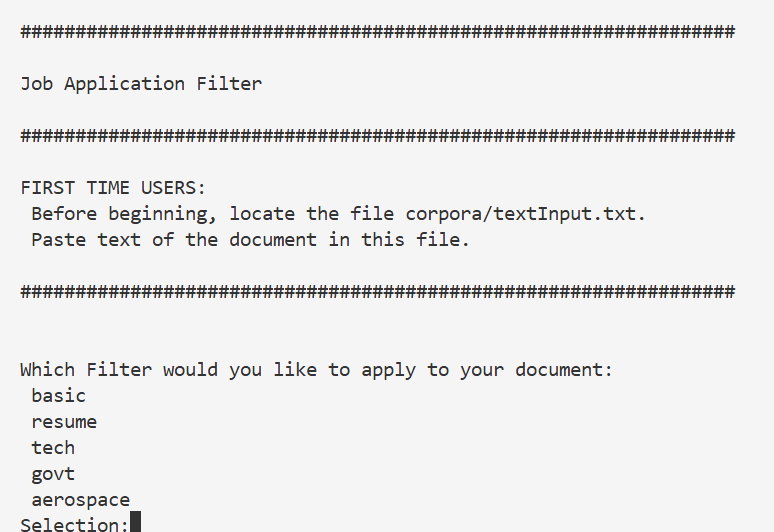
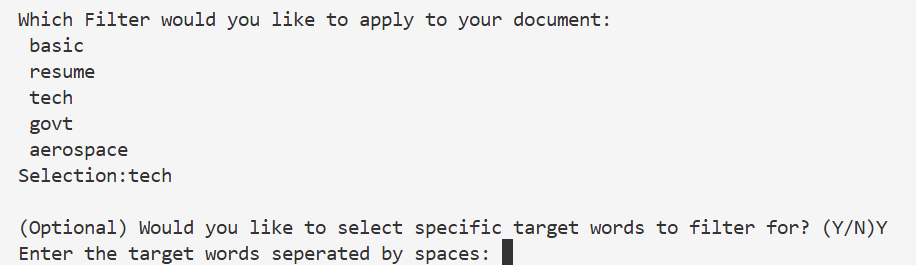
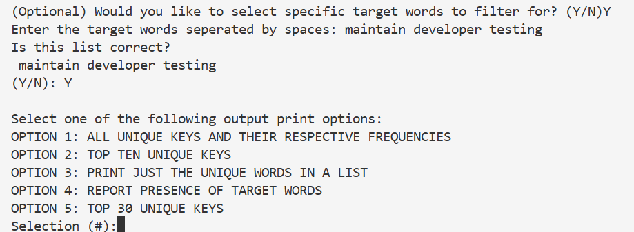

# AI Language Assistant

Finds industry-specific keywords in a document.

Filters can be applied to return highlighted keywords from a specific category, sifting out industry jargon and returning targetted insights on word usage data.


## Usage - Resume / Job Description Matcher
You can check how qualified you are for a job using this tool. 

This was designed as a hiring tool, ingesting a text to return featured topics. This can be applied to job descriptions as well as resumes. 

Using the "Execution Instructions" below, a keyword list can be generated for both the job description and a resume. By cross-referencing the list of keywords in the job description with that of the resume, one can see if the resume experience is a match for the job posting.

This tool can be used by recruiters and applicants alike to match people to their dream jobs!



## Execution Instructions
1. Input

Enter input text in: 'textAnalysis/corpora/textInput.txt'

2. Filter

What category you are searching for keywords in: DevOps? Financial Technology? Software Engineering? Aerospace?

Determine which 'skippable-words' filter you would like. In the file 'textAnalysis/skippables.py', look at the list of filters to select the category of jargon you would like to remove from your results.

For example:

'skippablesAerospaceWords' for Aerospace,

'skippablesTechAndGovtResumeWords' for tech jobs in the government.


3. (Optional) Search By Target Words



In addition to filtering out words, we can search for specific target words in a text. This can be useful to see if a candidate has a specific skill required by a job posting.

You can also select a prebuilt target word list such as 'defaultTargetWords' or 'aerospaceTargetWords'. In 'textInputReader.py', navigate to the 'targetWords' list variable under 'STEP 3 (Optional): CHOOSE YOUR TARGET SEARCH WORDS'.
If you are using 'aerospaceTargetWords', for example, change the targetWords variable to:

```targetWords = aerospaceTargetWords```


4. Configure a Print Option



Have fun experimenting with print styles! There's an elegant multi-column option in there as well!


5. Run

```
python3 'textAnalysis/textInputReader.py'
```


### Training Data
The model is made more precise with the filters located in 'skippables.py'. To refine the model for your own use, consider adding a new filter or ammending mine for your needs.